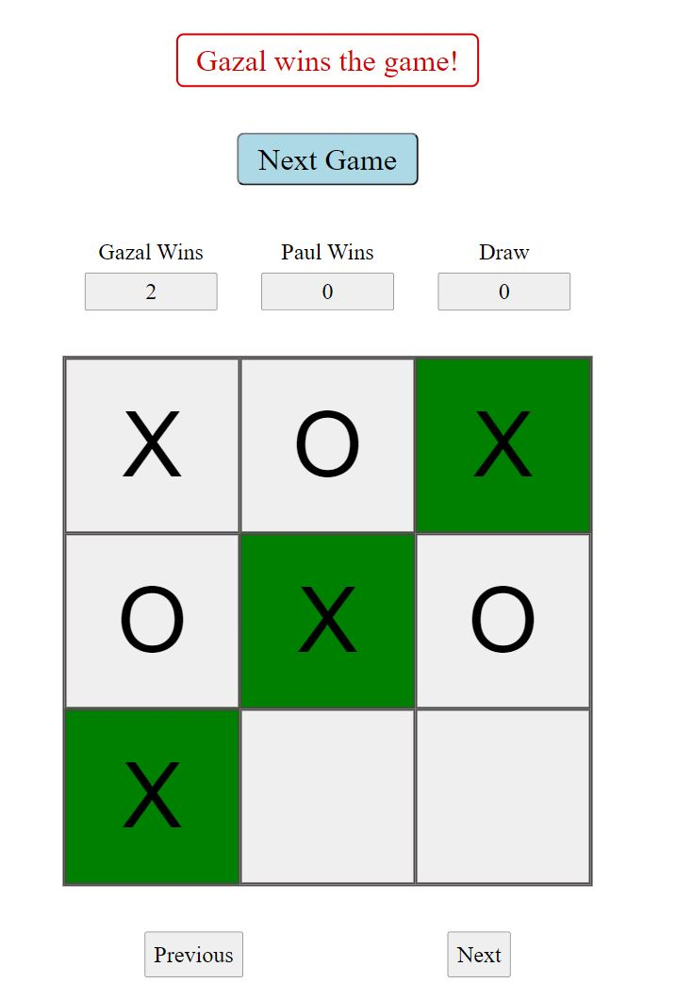

## About

This game of tic-tac-toe is developed using JavaScript, HTML, and CSS ( and SCSS) as the third project of the software development course by _Nology. It can be found at: https://gazalneb.github.io/javascript-game/

The game allows users to play in pairs, where Player 1 and Player 2 play using the "X" and "O" symbols, respectively. The symbols are inserted on a 3 * 3 box board, by clicking on one box at a time. The players move alternatively. To win, a player must occupy three consecutive boxes on the board, either in rows, columns, or diagonals. 

## User Interface (UI)

In the beginning, the players are prompted to enter their names and click on a start button. Their names then get updated on the scoring board displayed on top of the playing grid. A back button on the top-left corner of the page can take the players back to the name input section, where they can change their names without losing the progress in the game.

 

 

When a player gets a three-box streak, the winning boxes are highlighted in green. A message is also displayed on top of the screen with the name of the player that won. The game can be played multiple times. Once a game has a winner or is a draw, a next-game button appears on the top of the page, clicking on which leads users to a fresh grid for the next game. 

The UI also includes the count of Player 1 and 2 wins and game draws on the top of the board. The user can also click on the previous and next buttons at the bottom of the page to go back and forth the previous games. The previous games appear in the same format as a live game, with the winning boxes highlighted in green. However, they cannot be interacted with or changed by clicking on the boxes.

 

